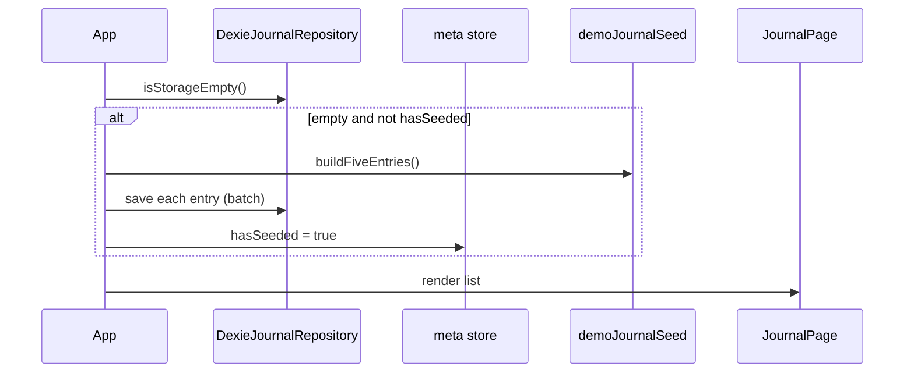

# Implementation Plan: Journal & App Shell (Feature 001)

**Branch**: `001-journal-app-shell` | **Date**: 2026-05-22 | **Spec**: [spec.md](./spec.md)

**Input**: Feature specification from `/specs/001-journal-app-shell/spec.md`

## Summary

Deliver a browser-first Reminder MVP: app shell (header, responsive menu, home tiles) plus a fully functional **Journal** for single-vehicle maintenance logging. Data persists locally in **IndexedDB** (Dexie.js). **Reminders** shows a badge driven by pending reminder works (Mileage/Date criteria, incomplete works only) and a placeholder page. **Trash** retains soft-deleted entries without UI. On first load with empty storage, **seed exactly five** demonstration journal entries per FR-016.

Stack: **Yarn 1 workspaces** monorepo — `apps/frontend` (React 19 + Vite + TypeScript strict), `packages/shared` (types + Zod + constants), `apps/api` (README stub only). No backend, auth, or cloud sync in 001.

## Technical Context

**Language/Version**: TypeScript 5.x (strict), Node.js 20+ LTS for tooling

**Primary Dependencies**:
| Package | Workspace | Purpose |
|---------|-----------|---------|
| `react`, `react-dom` | `apps/frontend` | UI (React 19 stable) |
| `react-router-dom` | `apps/frontend` | Routes: home, Journal, placeholders |
| `vite`, `@vitejs/plugin-react` | `apps/frontend` | Dev server and production build |
| `dexie` | `apps/frontend` | IndexedDB schema and queries |
| `zod` | `packages/shared` (+ frontend import) | Entry/work validation, shared schemas |
| `jest`, `ts-jest`, `@testing-library/react`, `@testing-library/jest-dom`, `@testing-library/user-event`, `jest-environment-jsdom` | `apps/frontend` | P1 behavior tests |
| `eslint`, `prettier`, TypeScript ESLint plugins | root / workspaces | Lint and format |

**Not used in 001** (explicit): Next.js, React Hook Form, UI component libraries, Playwright (optional later), Prisma/PostgreSQL, authentication SDKs.

**Storage**: IndexedDB via Dexie — stores: `journalEntries` (active), `trashEntries` (soft-deleted), `meta` (seed flag `hasSeeded`). Pending reminder works are **derived at read time** from active entries (not a separate store in 001) to avoid sync drift; badge query scans incomplete works with Mileage/Date criteria.

**Testing**: Jest 29 + `ts-jest` preset, `jest-environment-jsdom`, React Testing Library + `user-event`. Vite remains build tool; Jest uses `ts-jest` with path aliases mirroring `vite.config.ts` (`@/` → `src/`). `fake-indexeddb` (devDependency) for repository/unit tests without a browser. See [Test Strategy](#test-strategy-linked-to-user-stories) and `research.md` (Jest + Vite wiring).

**Target Platform**: Modern browsers (Chrome, Firefox, Safari, Edge — latest two versions); responsive SPA, offline-capable after first load.

**Project Type**: Yarn workspaces monorepo — web SPA + shared package; API stub only.

**Performance Goals**: First interactive paint snappy on laptop and mid-range mobile (constitution IV); Journal list/filter/sort smooth for **100+ entries** (SC-007) via indexed Dexie reads and in-memory filter/sort on loaded page (acceptable for hundreds of rows; no virtualization in 001).

**Constraints**:
- English-only UI (FR-015)
- Kilometers only for odometer and mileage targets (no Settings toggle)
- Client-only persistence; no network calls
- Bare-minimum dependencies; justify extras in Constitution Check
- Accessibility: semantic HTML, labels, keyboard-focusable controls, confirm dialogs for delete

**Scale/Scope**: Single user, single vehicle; 7 P1 user stories; ~15 routes/screens (mostly placeholders); seed 5 entries; target test set 20+ entries for filter acceptance (SC-003) in tests, not seed data.

## Constitution Check

*GATE: Must pass before Phase 0 research. Re-checked after Phase 1 design — **PASS** (no unjustified violations).*

### Principle I — Code Quality (Bare Minimum Web App)

| Requirement | Spec trace | Plan compliance |
|-------------|------------|-----------------|
| Smallest change / defer abstractions | MVP scope | Feature folders only where Journal/shell need them; no global state library |
| UI / logic / persistence separation | FR-006–FR-012 | `features/journal` (UI), `data/repositories` (Dexie), `packages/shared` (types + Zod) |
| Validate at boundaries | US3, FR-008 | Zod schemas in `packages/shared`; parse on Save; display field-level errors |
| No speculative features | Out of scope list | `apps/api` README only; placeholder routes only |
| Accessibility baseline | FR-001–FR-003 | Native controls, `<label>`, focusable menu/tiles, `dialog` or focus-trapped confirm for delete |
| No secrets in repo | — | No `.env` secrets; static SPA |

### Principle II — Testing Standards

| Requirement | Spec trace | Plan compliance |
|-------------|------------|-----------------|
| ≥1 automated test per feature / P1 scenario | US1–US7, SC-002 | Test matrix below maps each US to RTL tests |
| Critical edge cases | Edge Cases section | Whitespace description, non-numeric odometer, zero works, 101 chars, double-save guard |
| Deterministic CI tests | — | Jest + fake-indexeddb; no manual steps |
| Behavior-named tests | — | Describe blocks mirror user stories (e.g. "create and save journal entry") |

### Principle III — User Experience Consistency

| Requirement | Spec trace | Plan compliance |
|-------------|------------|-----------------|
| Shared visual language | FR-001 | CSS Modules: `variables.css` tokens (spacing, colors, typography) shared across shell and Journal |
| Predictable navigation | FR-001–FR-002, US5 | Fixed header + menu; tiles and menu items route consistently |
| Human-readable errors | SC-006, US3 | Zod issue messages mapped to English strings in `validationMessages.ts` |
| Empty / loading states | FR-013, constitution | Empty Journal copy; placeholder pages; loading skeleton optional minimal spinner |
| Responsive core flows | SC-007, FR-002 | Mobile overlay menu; Journal columns stack or scroll on narrow viewports |
| Destructive confirm | US4, FR-012 | Delete confirmation modal before `moveToTrash` |

### Principle IV — Performance

| Requirement | Spec trace | Plan compliance |
|-------------|------------|-----------------|
| Snappy load | SC-001 | Vite code-splitting by route; minimal bundle (no UI kit) |
| Smooth list/filter | SC-003, SC-007 | Load active entries once per Journal mount; filter/sort in memory; Dexie index on `odometer`, `workDate` |
| No unnecessary network | — | No fetch in 001 |
| Indexed storage queries | FR-005 | Dexie `orderBy` for default odometer sort when loading |

### Principle V — MVP Scope

| Requirement | Spec trace | Plan compliance |
|-------------|------------|-----------------|
| No scope beyond spec | Assumptions | Out of scope section enforced in tasks |
| Complexity justified in plan | — | See Complexity Tracking |

### FR / SC coverage matrix (acceptance traceability)

| ID | Plan artifact / implementation area |
|----|-------------------------------------|
| FR-001–FR-002 | `app/shell/` — Header, Menu, HomeTiles, routes |
| FR-003–FR-009 | `features/journal/` — layout, filters, list, form, works |
| FR-010–FR-011 | `pendingReminders.ts` + shell badge + `RemindersPlaceholder` |
| FR-012 | `DexieJournalRepository.delete` → trash store |
| FR-013 | `JournalEmptyState` |
| FR-014–FR-015 | `features/placeholders/*`, English copy files |
| FR-016 | `data/seed/demoJournalSeed.ts` + `meta.hasSeeded` |
| SC-001–SC-008 | Manual quickstart + automated US tests; SC-008 seed test |

### Dependency justification (constitution V)

| Dependency | Why not simpler? |
|------------|------------------|
| **Dexie** | Raw IndexedDB API is verbose and error-prone for multiple stores and upgrades; Dexie is one small dep with schema versioning |
| **Zod** | Spec mandates shared validation rules across UI and future API; manual validators duplicate schema |
| **React Router** | Multi-section shell with placeholders and deep-linkable Journal; conditional rendering alone does not scale |
| **Monorepo (3 packages)** | User-mandated layout; `packages/shared` prevents duplicating category list and Zod rules when `apps/api` arrives |
| **fake-indexeddb** | Test-only; enables repository tests without Playwright for MVP |

**Rejected for 001**: React Hook Form — multi-work dynamic form manageable with controlled React state + single Zod parse on Save (fewer deps, constitution I).

## Project Structure

### Documentation (this feature)

```text
specs/001-journal-app-shell/
├── plan.md              # This file
├── research.md          # Phase 0 decisions
├── data-model.md        # Entities and validation
├── quickstart.md        # Dev/test commands
├── contracts/           # Repository and schema contracts
└── tasks.md             # Phase 2 (/speckit-tasks — not created here)
```

### Source Code (repository root)

```text
reminder/
├── package.json                 # Yarn workspaces root
├── .yarnrc / yarn.lock
├── tsconfig.base.json
├── .eslintrc.cjs
├── .prettierrc
├── apps/
│   ├── frontend/
│   │   ├── package.json
│   │   ├── vite.config.ts
│   │   ├── tsconfig.json
│   │   ├── jest.config.ts
│   │   ├── index.html
│   │   └── src/
│   │       ├── main.tsx
│   │       ├── App.tsx
│   │       ├── app/
│   │       │   ├── routes.tsx
│   │       │   └── shell/
│   │       │       ├── Header.tsx
│   │       │       ├── SideMenu.tsx
│   │       │       ├── HomePage.tsx
│   │       │       └── RemindersBadge.tsx
│   │       ├── features/
│   │       │   ├── journal/
│   │       │   │   ├── JournalPage.tsx
│   │       │   │   ├── CategoryFilters.tsx
│   │       │   │   ├── EntryList.tsx
│   │       │   │   ├── EntryForm.tsx
│   │       │   │   ├── WorkEditor.tsx
│   │       │   │   └── journal.module.css
│   │       │   └── placeholders/
│   │       │       ├── PlaceholderPage.tsx
│   │       │       └── RemindersPlaceholder.tsx
│   │       ├── data/
│   │       │   ├── db.ts                 # Dexie instance + schema
│   │       │   ├── seed/
│   │       │   │   └── demoJournalSeed.ts
│   │       │   └── repositories/
│   │       │       └── DexieJournalRepository.ts
│   │       ├── domain/
│   │       │   └── pendingReminders.ts     # Badge count logic
│   │       └── shared/
│   │           └── ui/                   # Button, ConfirmDialog, etc.
│   │   └── src/__tests__/                # RTL tests by user story
│   └── api/
│       └── README.md                     # Future Express/Fastify + Prisma stub
└── packages/
    └── shared/
        ├── package.json
        └── src/
            ├── index.ts
            ├── constants/
            │   └── categories.ts         # FR-004 fixed list
            ├── types/
            │   └── journal.ts
            ├── schemas/
            │   └── journalSchemas.ts
            └── repositories/
                └── JournalRepository.ts  # Interface only
```

**Structure Decision**: Feature-oriented frontend under `apps/frontend/src` with clear `app/shell`, `features/journal`, `data`, and `domain` layers. Shared contracts live in `packages/shared` for reuse by future `apps/api`. Repository interface in shared package; Dexie implementation stays in frontend until API exists.

## Architecture

### Routing (`react-router-dom`)

| Path | Component | Notes |
|------|-----------|-------|
| `/` | `HomePage` | Tiles FR-001 |
| `/journal` | `JournalPage` | Two-column layout FR-003 |
| `/reminders` | `RemindersPlaceholder` | FR-011 |
| `/categories`, `/about`, `/faq`, `/trash`, `/settings` | `PlaceholderPage` | FR-014; FAQ empty |

Shell wraps all routes: `Header` + `SideMenu` + `<Outlet />`.

### Repository pattern

```text
packages/shared: JournalRepository (interface)
       ↑
apps/frontend: DexieJournalRepository
       ↓
apps/api (future): ApiJournalRepository
```

Operations: `listActive`, `getById`, `save`, `moveToTrash`, `countActive`, `isStorageEmpty`, `markSeeded`, `hasSeeded`. Trash restore not in interface until Feature 002.

### Pending reminders (FR-010, FR-011)

A **pending reminder work** is computed, not stored separately:

- Source: active journal entries only (not trash)
- Work is eligible iff: `done === false` AND criterion is `mileage` or `date` AND target value present
- `on_breakdown` → never pending
- Badge = count of eligible works across all entries

Feature 002 will add full Reminders list and due logic; 001 only stores criterion + target on each work.

### First-load seed flow (FR-016)



Rules implemented in `demoJournalSeed.ts`:
- Exactly 5 entries; works per entry `[1,2,3,4,2]` pattern
- Varied dates/odometer ascending spread
- Labels: Engine, Brakes, Fluids, Filters, General, etc.
- ≥2 Mileage, ≥2 Date, 1 On breakdown works across set
- Mix of `done` true/false so badge > 0
- Some costs empty, some numeric
- Subtle "Sample data" hint in Journal header or footer (FR-016 identifiability)

Seeding runs once per browser profile when **both** `journalEntries` and `trashEntries` are empty and `meta.hasSeeded` is false. User deletes seed entries normally; no auto-reseed.

### Journal UI behavior (implementation notes)

- **Filter**: client-side; entry included if any work has selected label (FR-004)
- **Sort**: default odometer desc; toggle date recent-first; reverse flips active key (FR-005); header shows date-first vs odometer-first emphasis
- **Form**: Cancel drops draft; Save runs Zod then repo; double-submit guarded with `isSaving` flag
- **Works**: new work inserted at top (FR-009); label cloud + remove chip
- **Total cost**: sum of work costs, empty → 0 (FR-007)
- **Delete**: confirm → `moveToTrash` (FR-012)

### Explicitly out of scope (001)

- Next.js, SSR, authentication, cloud sync
- `apps/api` implementation, PostgreSQL, Prisma
- Full Reminders list, Trash restore UI, Settings (km/miles), real Categories/About/FAQ content
- km/miles toggle — kilometers only
- Playwright (optional; not in MVP task list unless added in `/speckit-tasks`)

## Test Strategy (linked to User Stories)

### Jest + Vite + TypeScript setup (summary)

- **Build**: Vite (`vite.config.ts`) with `plugin-react`, strict TS, path alias `@/*`
- **Test**: Separate `jest.config.ts` — `preset: 'ts-jest'`, `testEnvironment: 'jsdom'`, `moduleNameMapper` matching Vite aliases, `setupFilesAfterEnv: ['<rootDir>/src/test/setup.ts']` (jest-dom, fake-indexeddb auto import)
- **Scripts**: `yarn test` from `apps/frontend`; root `yarn workspaces run test` in CI
- Details and alternatives: `research.md`

### Test matrix

| User Story | Focus | Example test files |
|------------|-------|-------------------|
| US1 Create/save | Form save, list update, cancel | `journal.create.test.tsx` |
| US2 Filter/sort | Brakes filter, date/odometer/reverse | `journal.filter-sort.test.tsx` |
| US3 Validation | 101 chars, zero works, missing criterion, whitespace | `journal.validation.test.tsx` |
| US4 Delete | Confirm/cancel, trash retention | `journal.delete.test.tsx` + `DexieJournalRepository.test.ts` |
| US5 Shell | Routes, placeholders, menu badge | `shell.navigation.test.tsx` |
| US6 Pending | Mileage/Date vs breakdown | `pendingReminders.test.ts` |
| US7 Seed | 5 entries, 1–4 works, filter after seed | `seed.demo.test.ts` |

**Edge cases** (spec): covered in US3/US1 tests — non-numeric odometer, negative cost, double save.

**SC mapping**: SC-002 via full P1 matrix; SC-003/SC-004 via filter/sort tests with 20+ fixture entries; SC-005 badge test; SC-006 validation messages; SC-007 optional perf smoke (manual quickstart); SC-008 seed test.

**Optional Playwright**: Defer unless `/speckit-tasks` adds 1–2 smoke tasks for SC-008 navigation; not required for constitution gate.

## Risks and Mitigations

| Risk | Impact | Mitigation |
|------|--------|------------|
| Monorepo overhead | Slower initial setup, workspace linking bugs | Minimal 3 packages; document `yarn install` in quickstart; shared package only types/schemas |
| Client-only storage | Data loss on clear site data / new device | Accept for MVP per spec; document in Assumptions; future `apps/api` in plan notes |
| Jest/Vite dual config drift | Broken imports in tests | Shared `tsconfig` paths; single alias map in both configs; CI runs `yarn test` |
| Derived pending reminders | Badge wrong if logic diverges from storage | Single `pendingReminders.ts` module; unit tests US6; no duplicate pending store |
| Seed runs twice | Duplicate demo entries | `meta.hasSeeded` + empty check before seed |
| 100+ entries layout | SC-007 failure | CSS overflow scroll; avoid heavy re-renders (memo list rows if needed) |

## Complexity Tracking

| Decision | Why Needed | Simpler Alternative Rejected |
|----------|--------------|------------------------------|
| Yarn workspaces (3 packages) | Mandated product layout; shared Zod/types for future API | Single package — would split shared types later anyway |
| Repository interface in `packages/shared` | Stable contract for Dexie now, HTTP later | Direct Dexie calls in components — couples UI to IDB |
| Dexie (vs raw IDB) | Schema version + typed tables | raw IDB — more boilerplate, error-prone migrations |
| `packages/shared` separate from frontend | API will import same schemas | Duplicating constants in frontend only |

No constitution violations requiring exception.

## Phase 0 & Phase 1 Outputs

- **research.md** — technology decisions (Dexie, forms, Jest/Vite, monorepo)
- **data-model.md** — Journal entry, Work, pending reminder derivation, Category label
- **contracts/** — `JournalRepository.md`, `journal-schemas.md`
- **quickstart.md** — install, dev, test, build

**Next command**: `/speckit-tasks` to generate `tasks.md` from this plan.
